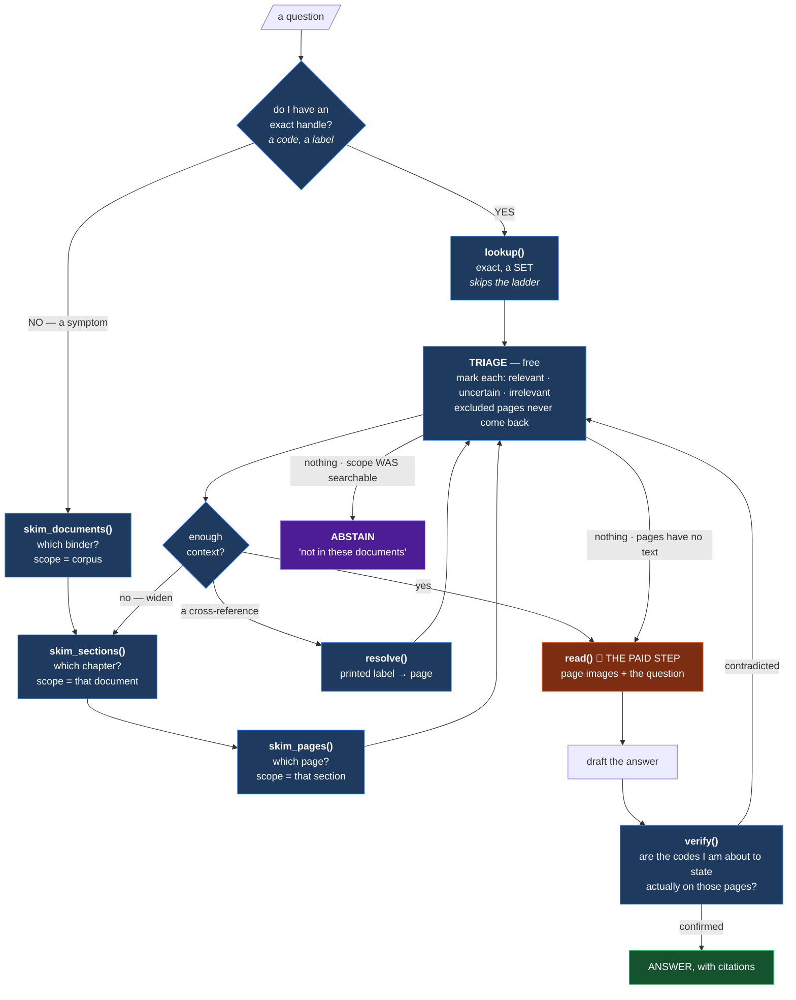

# The agentic retriever — modelled on how a person actually does it

> **Premise:** the metadata is only as good as the moves it enables. So design the tool
> surface from the way an experienced technician actually finds and checks an answer — not
> from the shape of the database.
>
> Builds on the existing five interfaces (`README.md` §3) and keeps their three refusals:
> **no scores, no routing, no composed answers.**

---

## 1. What a person actually does

Trace a real one. *"The carton discharge won't restart after an E-stop reset."*

```
1 · ORIENT       which machine is this? which binders do I even have?
                 → picks the C24 set, notices there's a manual, a diagram set,
                   and a safety list

2 · HANDLE       turns a symptom into something addressable
                 "there'll be a safety function about carton discharge"

3 · ENTER        two modes, chosen deliberately —
                 KNOWS the handle   → index → straight to the page
                 VAGUE              → contents page, skim headings, flip

4 · LOOK         on a schematic they look at the PICTURE first.
                 They recognise the shape of a circuit before reading a label.

5 · WIDEN        found it on page 30 → reads 29 and 31.
                 The answer straddles more often than not.

6 · FOLLOW       "see sheet 152" → turns to sheet 152. Possibly another document.

7 · CROSS-CHECK  before ordering the part, checks the number against the parts list.
                 Never trusts one page for a code.

8 · STOP         "this isn't in this manual — I need the E-diagram set"
                 or "I have to call the OEM."  Recognising absence is a skill.

9 · REMEMBER     doesn't re-open pages already checked.
```

**Nine moves. Most RAG agents are handed one tool — `search` — and told to do all nine
with it.**

---

## 2. Three ways an agent differs from the technician

These are what the interface has to compensate for.

| | a person | an agent |
|---|---|---|
| **skimming** | free — peripheral vision, flip a page in a second | every look costs money and latency |
| **context** | effortless; remembers the last twenty minutes | must be handed back what it already knows |
| **doubt** | *feels* uncertain and slows down | feels nothing — must be **told** the evidence is weak |

So: make triage cheap, make state explicit, and **put the uncertainty in the payload**.

---

## 3. The image is the reasoning context — text has three narrower jobs

This inverts the usual RAG assumption and it reshapes the whole surface.

An answer here comes from a **vision model looking at a page raster**. On a wiring schematic
there is no prose to reason over — only a diagram. So text is never the substrate. It has
three jobs, all supporting roles:

```
IMAGE   ->  REASONING       the only thing that can read a schematic

TEXT    ->  CHOOSING        summaries, so triage is cheap and free
        ->  PROVING         verify(), so a claim can be checked
        ->  CITING          quoting the document, not a paraphrase of it
```

### What that costs the current surface

Every tool that returns a page **hides the image**. `read()` sends rasters to Gemini
internally and hands back an extract; the caller never sees the page. So the agent can only
ever *delegate* reasoning, never do it. Three routine human moves become impossible:

| move | why it breaks |
|---|---|
| **compare two pages** | `read` returns two independent per-page extracts. The cross-page inference is gone. |
| **ask a follow-up** | a second question about the same page re-bills a full vision call, because nothing was kept |
| **zoom in** | a person leans in on a schematic. There is **no tool** for *"show me that corner bigger."* |

The fix is one new tool that returns **material instead of an answer** — `fetch`, in §7.

### The other consequence: `verify` needs a third state

When a vision model reads a code off a raster, **transcription error is the dominant risk**.
That makes `verify` the most load-bearing check in the loop — and it currently cannot express
its own blind spot:

```
present: true      the code IS in this page's text layer
present: false     the text layer exists and does NOT contain it
unverifiable       <- MISSING: there is no text layer to check against
```

Collapsing the third into `false` tells the agent *"that code is not on the page"* about a
scanned page where it simply could not look. Same disease as P5, one level down.

---

## 4. The zoom ladder — one verb, three granularities

A person never searches 142 pages. They **narrow, then repeat the same move in a smaller
space**:

```
corpus      "which binder?"       skim  ->  3 documents, one strong
document    "which chapter?"      skim  ->  section, pages 1-30
section     "which page?"         skim  ->  p001, p002
page        "what does it say?"   READ  ->  the paid call
```

**Same verb. Three zoom levels. The scope tightens each round.** Which means `expand` is not
a terminal move — it is *"re-scope, then skim again"*.

### All three levels come from the ONE page index

No extra storage. The same page hits, aggregated differently:

```python
skim_documents(query, scope)   # page hits grouped by doc_id, scored from best ranks
  -> [{doc_id, title, pages_matched: 12, best_rank: 1, summary, doc_type}]

skim_sections(query, scope)    # grouped by section_id
  -> [{section_id, title, page_range: [1,30], pages_matched: 4}]

skim_pages(query, scope)       # the pages themselves
  -> [{page_id, printed_page_no, summary, page_kind, why, flags, next}]
```

Grouping by `doc_id` also fixes a real failure mode: **one chatty document can occupy every
slot of a page-level search and bury the document that actually answers.** Aggregating first
gives diversity — which is what *"which binder?"* actually means.

### The exact path skips the ladder

```
"SF 1.2a"          -> lookup -> page.       No ladder. The agent has a handle.
"won't restart"    -> skim -> skim -> skim -> read.
```

Exactly the human split between using the index and using the contents page.

### Hard scope now, soft weights later

```
hard scope   a filter (must)   "only the C24 diagram set"
soft scope   a boost           "prefer diagrams, do not exclude the manual"
```

Qdrant filters are boolean, so soft scoping means per-scope branches re-fused client-side.
Doable — RRF already carries per-surface weights — but real machinery. **Iterative hard
narrowing gets most of the value.** Add weights only if the agent is observed committing to a
scope it should not have.

### What the ladder costs

Latency, never money: ~150 ms per level, so a three-level descent is under half a second and
free. **Its value scales with corpus size** — at 142 pages a single filtered page-search may
be equivalent; across several 1,440-page manuals it is the difference between finding the
right binder and drowning in one. Measure before assuming.

---

## 5. The loop



Three structural points, all taken from the human:

**Narrowing is the same move repeated.** Three skims, each in a smaller scope. Not three
different algorithms — one, called at three zoom levels.

**The expensive step happens once, late, after free narrowing.** Every skim, triage, resolve
and verify is free. `read` is the entire budget. A person skims for two minutes and reads one
page carefully.

**Verification happens AFTER drafting, not before.** People say *"it's K158 — let me just
confirm that"*. The agent drafts, then checks the codes it is about to assert.

---

## 6. Eight interface principles

### P1 · One tool per decision, not per data structure

The agent should reach for a tool because it *decided something*, not because it knows the
schema. `lookup` vs `search` is a decision about what kind of handle you have — which is why
merging them into one "smart search" is a correctness bug, not a convenience.

### P2 · Cheap to triage, expensive to consume

`search` returns **enough to choose, never enough to answer**:

```json
{ "page_id": "TC1E-SF@1.3#p001", "printed_page_no": "Page 1 of 55",
  "summary": "Emergency-stop circuit for the carton discharge unit…",
  "page_kind": "schematic", "why": ["dense", "lexical"], "rank": 1,
  "flags": [], "grounded_rate": 0.95 }
```

**No full text.** If the agent could answer from the search result it would stop reasoning and
start pattern-matching on snippets. Make it choose, then pay.

*(This is what the page `summary` from the new S2 schema buys — a triage surface that did not
exist before.)*

### P3 · Every result carries its own trust level

The pipeline's disclosure discipline exists for exactly this moment:

```
verified: true|false        did the page's own text back this?
grounded_rate: 0.0-1.0      how much of what the model saw is in the text layer
flags: ["no_text", "interpolated_head", "noncontiguous_unit"]
interpolated: true          this page number was inferred, not observed
```

An agent that cannot tell strong evidence from weak will assert both with the same confidence.

### P4 · Results carry the next moves

A person looking at a page *sees* "continued overleaf" and the cross-references. Put those in
the result so retrieval becomes navigation instead of repeated blind search:

```json
"next": {
  "expand":     "TC1E-SF@1.3#s004",        the section this page belongs to
  "neighbours": ["…#p029", "…#p031"],
  "references": ["sheet 152", "7-12"]      resolvable printed labels
}
```

Without this the agent must *guess* that more exists. With it, the affordances are visible —
which is exactly what a physical page gives a human.

### P5 · Absence is a typed answer, not an empty list

The single most important one. These are **different states** and must not collapse:

| state | what the agent should do |
|---|---|
| `not_found` — searched, genuinely absent | **abstain**: "not in these documents" |
| `not_searchable` — candidate pages have no text layer | **escalate to vision**: `read` them anyway |
| `out_of_scope` — no document matched the filters | **re-orient**: widen the scope |
| `error` — a backend is down | **retry / report** — never abstain |

Collapsing 2 into 1 makes the agent confidently say *"that part number doesn't exist"* about a
scanned parts list. Collapsing 4 into 1 turns an outage into a fabricated abstention.

*(The existing design already separates `200`-empty / `400` / `503`. P5 splits the empty case
further, which the new `no_text` flag makes possible.)*

### P6 · Never silently degrade

Already the rule here, and it should stay: an unknown filter key is a `400`, not a slow scan.
A capped result set says `"capped": true`. A guess says `"interpolated": true`.

### P7 · Verification is a move the agent makes

The ingestion-time allowlist gate disappears in the new design — and it comes back **here**,
as something the agent calls deliberately:

```python
verify(claims=["K158", "EAO 84-5140.0020"], page_ids=["TC1E-SF@1.3#p001"])
→ {"K158": {"present": true,  "page_ids": ["…#p001"]},
   "EAO 84-5140.0020": {"present": true, "page_ids": ["…#p001"]}}
```

With a full-text index this is a trivial exact filter — free, fast, and it lets the agent
check its own answer before asserting it. **The guarantee moves from "we filtered your data"
to "you can check your claim"**, which is both more honest and more useful.

### P8 · Return material as well as answers

`read` delegates reasoning and returns a conclusion. `fetch` returns the page itself and lets
the caller reason. **Both must exist**, because they trade different budgets:

| | what you get | what it costs |
|---|---|---|
| `fetch` | the raw page — **you** reason over the image | your own context, ~1-2k tokens per image |
| `read` | a bounded extract — a sub-model reasons | 🔴 a Gemini call; your context stays small |

Delegate when you want a cheap bounded sub-answer. Fetch when you need to reason *across*
pages, keep the evidence, or ask a follow-up without paying twice.


---

## 7. The tool surface

**Six tools**, grouped by the decision each serves. The ladder absorbed `scope` and `expand`
into `skim`; `fetch` is added because reasoning happens over images (§3).

| | tool | signature | cost |
|---|---|---|---|
| **NARROW** | `skim_documents` | `(query, scope?, exclude?) → [{doc_id, title, doc_type, pages_matched, best_rank, searchable_ratio}]` | free |
| | `skim_sections` | `(query, scope, exclude?) → [{section_id, title, page_range, pages_matched}]` | free |
| | `skim_pages` | `(query, scope, exclude?) → [{page_id, printed_page_no, summary, page_kind, why, flags, next}]` | free |
| **JUMP** | `lookup` | `(label, scope?, include_unverified=False) → a SET + total + capped` | free |
| **FOLLOW** | `resolve` | `(printed_label, doc_id?) → page_id + interpolated` | free |
| **LOOK** | `fetch` | `(page_ids, include=["image","text","summary"], dpi=220, region=None) → the raw pages` | free-ish |
| **COMPREHEND** | `read` | `(page_ids, question) → extracts + per-page provenance` | 🔴 **the budget** |
| **CHECK** | `verify` | `(claims, page_ids) → per-claim present/absent + where` | free |

*(Eight rows, six distinct verbs — the three `skim_*` share one implementation.)*

### Why three names instead of one `granularity` argument

One polymorphic `skim(query, scope, granularity)` is tidier code and a **worse tool surface**.
An LLM agent chooses far more reliably between three distinct names than between three values
of an enum buried in a parameter — and the three names make the ladder self-documenting. An
agent reading the tool list learns the strategy without being told it.

Implement it once; expose it three times.

### `scope` is a value, not a tool

It is whatever the previous rung returned:

```
scope_0  {}                                              142 pages · the corpus
scope_1  {doc_id: "TC1E-SF"}                              55 pages · one binder
scope_2  {doc_id: "TC1E-SF", section_id: "…#s004"}        30 pages · one chapter
```

`skim_documents` with no scope answers the orientation question directly — *"what have I got,
and how much of it can actually be searched?"* — because every row carries its own
`searchable_ratio`:

```json
skim_documents("carton discharge restart", scope={"subjects": ["C24"]})
→ [{ "doc_id": "TC1E-SF", "doc_type": "safety_function_list",
     "pages_matched": 12, "best_rank": 1, "searchable_ratio": 1.00,
     "summary": "C24 safety component circuit list, 122 safety functions" },
   { "doc_id": "CE-TC1AV8", "pages_matched": 0, "searchable_ratio": 0.00 }]
```

That last row is the agent's blind spot, made visible: **image-only, nothing to match by text.**
If the text route finds nothing, that is where to look with `read`.

### `fetch` — the missing "LOOK" move

```python
fetch(["…#p001"], dpi=150)                             # the whole page, cheap
fetch(["…#p001"], dpi=400, region=[0.5, 0.0, 1.0, 0.4])  # that corner, properly
```

`region` is normalised `[x0, y0, x1, y1]`. PyMuPDF renders a clip at any dpi **on demand** —
no new storage, nothing precomputed. That is the zoom loop a technician performs on a
schematic, and today it has no tool at all.

It is also the concrete payoff for adding bounding boxes (`IMPROVEMENTS.md` §D1): with them,
`region=[…]` becomes `around="K158"` and the agent stops guessing coordinates.

**Budget note.** Images are the expensive thing in a context window, so `fetch` must be
bounded like `read` is — cap the page count, default to `dpi=150`, and let the agent opt into
detail rather than receiving it.

### How robust is each tool, once reasoning is image-first?

| tool | verdict | why |
|---|---|---|
| `skim_documents` / `skim_sections` | ✅ **robust** | aggregation is structural — nothing depends on text quality |
| `skim_pages` | ✅ **robust** | the `summary` is *derived from the image*, so it triages schematics as well as prose. This is the tool that gains most from the new S2 schema. |
| `resolve` | ✅ **robust** | printed labels are observed per page; `interpolated` already discloses a guess |
| `read` | ⚠️ **works, but blind** | correct for delegated reasoning; **hides the image**, so the caller can never reason across pages or follow up without re-billing |
| `lookup` | ⚠️ **has a blind spot** | text-index only, so **scanned pages are invisible to it**. Must return `not_searchable`, never a bare empty set (§6 · P5) |
| `verify` | ⚠️ **lies by omission** | needs the third state `unverifiable` (§3), or it reports "absent" for pages it could not check |
| `fetch` | ❌ **missing** | the reasoning substrate is unreachable. The single biggest gap. |

**Pattern worth naming:** the two `⚠️` tools fail the *same* way — a text-derived surface that
cannot say *"I had nothing to look at."* On a corpus where the image is the reasoning context
and some pages have no text at all, that silence is the dominant failure mode, not ranking
quality.

### Aggregation is free — it is the same index

All three rungs are the same page query, grouped differently. No extra storage, no second
collection. Grouping by `doc_id` also fixes a real failure: **one chatty document can occupy
every slot of a page-level search and bury the document that answers.** Aggregating first is
what makes *"which binder?"* a real question rather than a re-ranking accident.

---

## 8. A worked trace

*"The carton discharge won't restart after an E-stop reset."*

```
1  skim_documents("carton discharge restart after emergency stop",     free
                  scope={subjects:["C24"]})
   -> TC1E-SF        12 pages matched · searchable 1.00   <- the binder
      LTC1AV81        2 pages matched · searchable 1.00
      CE-TC1AV8       0 pages matched · searchable 0.00   <- blind spot, noted

2  skim_sections(same query, scope={doc_id:"TC1E-SF"})                 free
   -> section "Emergency stop circuits"   pages 1-30 · 6 matched

3  skim_pages(same query, scope={doc_id:"TC1E-SF",                     free
                                 section_id:"…#s004"})
   -> p001  "Emergency-stop circuit for the carton discharge unit…"
      p002  "Reset interlock conditions for the discharge start…"

4  read(["…#p001","…#p002"], question)                                 🔴 THE ONLY PAID CALL
   -> "SF 1.2a: reset requires Q25 released AND K158 energised"

5  verify(["Q25","K158","SF 1.2a"], ["…#p001"])                        free
   -> all three present

6  ANSWER, citing p001-p002
```

**One paid call in six steps.** Three free skims narrowed 142 pages to 2 — the same shape as
a technician picking a binder, checking the contents, flipping to a chapter, then reading one
page properly.

### The exact path, for comparison

```
1  lookup("SF 1.2a")            free   -> p001, p002 · total 2 · capped false
2  read([...], question)        🔴
3  verify([...])                free
```

No ladder at all. The agent had a handle, so it used the index instead of the contents page.

### And the failure branch

```
1' skim_documents(...)  ->  0 pages matched anywhere
   but CE-TC1AV8 reported searchable_ratio 0.00

   -> the agent does NOT abstain. It reads the image-only pages.
   -> still nothing: ABSTAIN, naming which documents were searched
      and which could not be searched by text at all.
```

Only possible because §6 · P5 keeps *absent* and *unsearchable* distinct.

---

## 9. Correction — six loops, and only one is inside `read`

### Loop 0 — triage: reject before you read

The cheapest correction happens **before** any money is spent. A skim returns ~10 candidates;
the agent marks each from its summary, and only the survivors go forward.

```
skim_pages  ->  10 candidates
                  |
       mark each from the summary, free
                  |
   relevant (2)   uncertain (3)   irrelevant (5)
        |              |                |
      read          fallback         excluded from
                     pool          subsequent skims
```

**Tri-state, not binary.** The `uncertain` pool is what you fall back to when the confident
picks fail to answer. Binary marking discards it and forces a re-skim from scratch — the same
mistake as a two-state `verify` or an untyped absence.

#### The state lives in the agent, not the service

The engine is deliberately stateless. A server-side relevance session buys eviction,
concurrency and a new failure mode; the agent's context window already *is* its working
memory. So the only thing the service owes is one parameter:

```python
skim_pages(query, scope, exclude=["…#p014", "…#p022"])
```

Tiny — and it is what finally makes **move 9** possible (*"doesn't re-open pages already
checked"*). Without it every narrower skim hands back the pages just rejected.

#### The risk: a summary can hide the answer

A summary is a model's abstraction of the page. It can omit the one line that matters, so
triage is itself a lossy filter that **can reject the right page**. Five safeguards and mitigations:

| | |
|---|---|
| **rejections stay soft** | on `sufficient: false`, un-reject and try the `uncertain` pool *before* widening scope |
| **do not filter a small set** | with 3 candidates, read them. Filtering to 1 saves nothing and risks everything |
| **use `why` as the signal** | a page that hit on `lexical` for an exact code is stronger evidence than one that hit on dense similarity alone |
| **auto-promote exact hits** | if a query contains an exact identifier and the hit `why` is `lexical`, bypass summary triage and auto-promote to candidate pool |
| **strict agent-prompt constraints** | enforce the tri-state triage workflow directly in the agent's system prompt, making the fallback to `uncertain` mandatory before re-skimming |

#### VLM Cost & Latency Mitigations

Since reasoning is powered by Gemini vision calls (`read`), keeping API cost and latency bounded is critical. Three system safeguards:

| | |
|---|---|
| **strict page caps on `read`** | cap the number of page images sent to `read` per query to a maximum of 3. If more are needed, require sequential fetching or user consent |
| **DPI-budgeted `fetch`** | default `fetch` to `dpi=150` for general layout checks; escalate to `dpi=300` or `dpi=400` only for targeted `region` crops around specific bounding boxes |
| **image caching** | cache the rendered page images on-demand to avoid re-rendering PDF pages during multi-turn agent conversations |

#### The marks are free evaluation data

Every decision is a labelled pair — *query → page → relevant?* — produced by normal operation
at no extra cost. That is exactly what is needed to tune surface weights and measure retrieval
quality. Write it to telemetry, but **never as a mandatory tool call**: marking is a reasoning
act, and putting a round-trip inside it would slow every turn to record something optional.

---

Two kinds of correction, and conflating them is what turns a retrieval engine into an
answering engine:

```
TRANSCRIPTION   "I read K153; the text layer says K158"
                mechanical · deterministic · same page · NO judgment
                -> INSIDE read, automatic, always

RETRIEVAL       "this page does not answer the question"
                a judgment about the search itself
                -> OUTSIDE read, in the agent's loop
```

The second inside `read` would break the engine's own refusal (§11) — *composition and the
grounding gate are the caller's.* The first is not composition, it is **proofreading**, and
the existing contract already asks for it: `read` returns *"extract · page provenance ·
`text_layer_backed` per id."*

### Why it must be stamped, not left to the caller

An unannotated extract invites a naive agent to report whatever the vision model said. A
stamped one cannot be missed:

```json
{ "extract": "Reset requires Q25 released and K158 energised",
  "codes": [ {"raw": "Q25",  "verified": "true"},
             {"raw": "K158", "verified": "true"},
             {"raw": "K153", "verified": "false"} ],
  "sufficient": true,
  "flags": [] }
```

`verified` carries the same three states as `verify` itself — `true` / `false` /
`unverifiable` (§3). On a page with no text layer **every** code comes back `unverifiable`,
which is the honest answer and the one that should make an agent slow down.

### `read` also owes the loop a sufficiency signal

Not correction — honest reporting, which *triggers* correction:

```
sufficient: true      this page answers the question
sufficient: false     I looked; it does not. Do not make me guess.
```

Without it the agent cannot separate *"the answer is no"* from *"wrong page"*, and will
compose an answer from a page that never contained one.

### The six loops

| | trigger | correction | where |
|---|---|---|---|
| **0** | a candidate looks wrong in triage | mark `irrelevant`, `exclude` it from later skims | the loop — **before any spend** |
| **1** | a code was misread | stamp `verified: false` on it | **inside `read`** — automatic |
| **2** | about to assert a claim | `verify(claims, page_ids)` | after `read` — deliberate |
| **3** | `sufficient: false` | widen the scope, re-skim | the loop |
| **4** | `verify` contradicts the draft | try a different page | the loop |
| **5** | nothing found **and** `searchable_ratio < 1` | `fetch` / `read` the image-only pages | the loop |

Only #1 lives inside a tool; #0 is the cheapest, because it spends nothing. Everything else is the agent's judgment — which is exactly what
stops the engine quietly becoming the answerer.

---

## 10. What this does and does not mimic

The **procedure** transfers faithfully — orient, narrow, zoom, widen, follow, check before
asserting, stop. Every move in §1 has a tool.

**Expertise does not:**

| a technician has | the agent has |
|---|---|
| priors — *"E-stop faults are usually the reset relay"* | no domain intuition; starts cold every session |
| peripheral recognition — spots the right diagram while flipping | must embed and rank; skimming is *cheap*, never free |
| the machine itself to go and look at | only the corpus |
| document quirks — *"chapter 7 of this manual is always wrong"* | nothing accumulated across sessions |

**Human-like process, not human-like judgment.** The nearest buildable analogue to experience
is a memory of what worked — which documents answered which kinds of question — but that is a
separate system, and conflating it with retrieval would put unverifiable priors inside a
surface whose entire value is that its claims are checkable.

---

## 11. What stays refused

The existing three refusals hold, and the human model supports each:

| refused | why, in human terms |
|---|---|
| returning a **score** | a technician doesn't say "I'm 0.83 sure" — they say "it's on this page" or "let me check" |
| **routing** the query | choosing the binder is *the expert's* judgment, not the shelf's |
| composing the **answer** | the manual doesn't answer; it shows you the page. Safety precedence is the reader's call |

Add a fourth:

| **fuzzy matching on codes** | a person who misreads `K73` as `K78` fits the wrong relay. A miss must be *"no such code"* plus neighbours **labelled as different parts** — never a silent nearest match |

---

## 12. What to build, in order

| | | why first |
|---|---|---|
| **1** | `summary` in the search result | P2 is impossible without it — this is the triage surface |
| **2** | `verify` | trivial on a full-text index, and it closes the loop the ingestion gate used to |
| **3** | typed absence (`not_found` / `not_searchable` / `out_of_scope`) | stops the worst failure: confident abstention about a scanned page |
| **4** | `next` affordances on every hit | turns search into navigation |
| **5** | **`fetch`** — image + text, with `dpi` and `region` | the reasoning substrate is currently unreachable; also the only "zoom" the agent has |
| **6** | `unverifiable` as a third `verify` state | stops "absent" being reported for pages that could not be checked |
| **6b** | `sufficient` + per-code `verified` on every `read` | correction loops #1 and #3 — the caller cannot miss it |
| **6c** | `exclude` on every `skim_*` | correction loop #0 — the cheapest one, and move 9 of §1 |
| **7** | `skim_documents` / `skim_sections` — the ladder rungs | the diversity win; scales with corpus size |
| **8** | `searchable_ratio` on every document row | the agent's blind spot, made visible |

1, 3, 4 and 6 are payload changes with no new mechanism. 2 and 5 are new endpoints — `fetch`
is a render-on-demand, so it needs no new storage either. 7 and 8 are the same page query
grouped differently.

**If you build only two things: `fetch` and `verify`.** Together they let the agent look at
the evidence itself and then check what it is about to say — which is the whole of moves 4
and 7 in §1, and neither is possible today.

---

## One line

> **Give the agent the moves a person actually makes — orient, narrow, look, widen, follow,
> check, stop — and make every result say how much to trust it.**
>
> **The image is what it reasons over; the text is how it chooses, proves and cites. So the
> surface must hand back the page itself, not only conclusions about it.**
