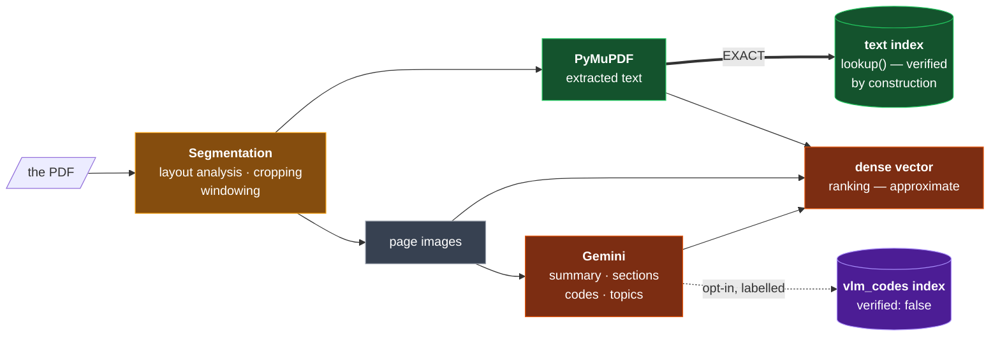
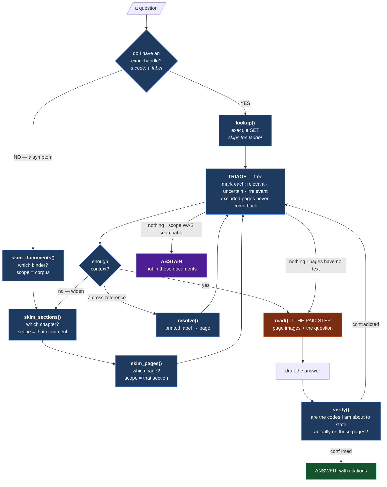

# Pipeline Architecture

```mermaid
flowchart LR
    PDF[/"the PDF"/] --> SEG["<b>Segmentation</b><br/>layout analysis · cropping<br/>windowing"]
    
    SEG --> EX["<b>PyMuPDF</b><br/>extracted text"]
    SEG --> IMG["page images"]
    IMG --> VLM["<b>Gemini</b><br/>summary · sections<br/>codes · topics"]

    EX ==>|"EXACT"| TI[("<b>text index</b><br/>lookup() — verified<br/>by construction")]
    EX --> DV
    IMG --> DV
    VLM --> DV["<b>dense vector</b><br/>ranking — approximate"]
    VLM -.->|"opt-in, labelled"| TI2[("<b>vlm_codes index</b><br/>verified: false")]

    classDef good fill:#14532d,stroke:#22c55e,color:#fff
    classDef paid fill:#7c2d12,stroke:#ea580c,color:#fff
    classDef store fill:#374151,stroke:#9ca3af,color:#fff
    classDef warn fill:#4c1d95,stroke:#a78bfa,color:#fff
    classDef seg fill:#854d0e,stroke:#f59e0b,color:#fff
    class EX,TI good
    class VLM,DV paid
    class IMG,SEG store
    class TI2 warn
    class SEG seg
```

# Agentic Retrieval Loop

```mermaid
flowchart TD
    Q[/"a question"/] --> HY{"do I have an<br/>exact handle?<br/><i>a code, a label</i>"}

    HY -->|"YES"| LK["<b>lookup()</b><br/>exact, a SET<br/><i>skips the ladder</i>"]

    HY -->|"NO — a symptom"| L1["<b>skim_documents()</b><br/>which binder?<br/>scope = corpus"]
    L1 --> L2["<b>skim_sections()</b><br/>which chapter?<br/>scope = that document"]
    L2 --> L3["<b>skim_pages()</b><br/>which page?<br/>scope = that section"]

    LK --> TRI
    L3 --> TRI["<b>TRIAGE</b> — free<br/>mark each: relevant · uncertain · irrelevant<br/>excluded pages never come back"]

    TRI --> NAV{"enough<br/>context?"}
    NAV -->|"no — widen"| L2
    NAV -->|"a cross-reference"| RES["<b>resolve()</b><br/>printed label → page"]
    RES --> TRI

    NAV -->|"yes"| RD["<b>read()</b> 🔴 THE PAID STEP<br/>page images + the question"]
    RD --> DRAFT["draft the answer"]
    DRAFT --> VF["<b>verify()</b><br/>are the codes I am about to state<br/>actually on those pages?"]

    VF -->|"confirmed"| ANS["ANSWER, with citations"]
    VF -->|"contradicted"| TRI
    TRI -->|"nothing · scope WAS searchable"| STOP["<b>ABSTAIN</b><br/>'not in these documents'"]
    TRI -->|"nothing · pages have no text"| RD

    classDef free fill:#1e3a5f,stroke:#3b82f6,color:#fff
    classDef paid fill:#7c2d12,stroke:#ea580c,color:#fff
    classDef good fill:#14532d,stroke:#22c55e,color:#fff
    classDef bad fill:#4c1d95,stroke:#a78bfa,color:#fff
    class LK,L1,L2,L3,TRI,RES,VF,HY,NAV free
    class RD paid
    class ANS good
    class STOP bad
```
