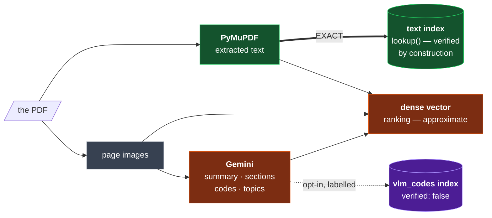

# The generic pipeline

> **Goal:** ingest any PDF, from any domain, with no regexes, no per-corpus grammar and no
> configuration — and end up with *less* code than today.
>
> **The move that makes it work:** exact search stops being a curated list of verified
> identifiers and becomes a **full-text index over the extracted text**. Verification stops
> being a procedure and becomes a structural property.

---

## 1. The one rule

Everything below depends on a single boundary:

> ### Lexical surfaces index extracted text. The dense surface may include model output.



**Why it matters.** Today `entity_keys` is populated from what the *model* claims, so it needs
an allowlist gate to check every entry against the page. A text index is built from what
PyMuPDF *extracted*, so a hallucinated code **cannot be in it** — there is nothing to verify.

That one substitution is what lets ~200 lines and the pipeline's most complex concept
disappear, and it is void the moment model-emitted text enters a lexical index. Hence the
rule.

---

## 2. What the pipeline becomes

| step | stage | what changes |
|---|---|---|
| 01 | entry | facets now come from filename / metadata / the uploader |
| 02 | S0 probe + text + render | **unchanged** |
| 03 | S1 document facts | prompt generalised; still picks the ladder |
| 04 | windowing + `extract_key` | **unchanged** |
| 05 | S2 extraction | **new schema** — summary, sections, codes, topics; no identifier grammar |
| 06 | derivation | the offset and the join survive; **the gate is deleted** |
| 07 | stitching | unchanged algorithm, now grouping **sections** instead of units |
| 08 | embedding | payload gains the summary |
| 09 | indexing | **two full-text indexes** replace `entity_keys` |
| 10 | gates | coverage from the probe; `key_coverage` replaces `class_totality` |
| 11 | export | ranges + summaries, or deleted — see §9 |

Steps 02, 04 and the whole caching architecture are untouched. They were never the coupled
part.

---

## 3. The S2 response schema

```python
class SectionRef(BaseModel):
    title:    str  = Field(description="the section/procedure/topic this page belongs to, "
                                       "as printed or as you would name it")
    is_start: bool = Field(default=False, description="true only if it BEGINS on this page")

class PageOut(BaseModel):
    page_index:      int  = Field(description="1-based WITHIN THIS EXCERPT, not the book")
    printed_page_no: str  = Field(default="", description="the page label as printed, VERBATIM")
    page_kind:       str  = "prose"     # prose|table|schematic|exploded|cover|toc|index|blank
    lang:            list[str] = []
    sections:        list[SectionRef] = []
    summary:         str  = Field(description="2-3 sentences on what is SPECIFIC to this "
                                              "page. Do not describe the document generally.")
    codes:           list[str] = Field(default=[], description="every code, tag, part or "
                                                               "reference number, VERBATIM")
    topics:          list[str] = Field(default=[], description="short lowercase labels for "
                                                               "what this page is about")

class WindowOut(BaseModel):
    pages: list[PageOut]
```

### What changed, and why

| | |
|---|---|
| `units[]` → `sections[]` | a section is a title and a start flag. No `kind` enum, no grammar, no `attrs`. Still **presence per page, never extent** — so stitching still works across window folds. |
| `identifiers[]` → `codes[]` | same verbatim strings, but they now feed the dense vector and the opt-in index — never the exact one |
| **`summary`** new | the biggest retrieval win. See §4. |
| **`topics`** new | replaces the hardcoded `pl= / sicurezza / category 3` keyword list |
| no `refs[]` | measured: **0 reads** anywhere in the codebase |

### The prompt rule for summaries

> *"2–3 sentences on what is SPECIFIC to this page."*

Ask for description and you get *"This page shows a technical diagram…"* on every page —
which makes the dense vector **less** discriminative, not more. Ask for what distinguishes
this page from its neighbours.

---

## 4. Why the summary is the biggest win

On a schematic the text layer has no sentences at all:

```
text     "B221 --> K158 - SI3  (B&R X20SI4100 - Safe Dig. In.- 2 channel wiring)
          YV1  FESTO VOFA-L26-T32C-M-G14-1C1-APP (574011)  Q59 …"

summary  "Emergency-stop circuit for the carton discharge unit: pressing the panel
          E-stop de-energises the discharge valve via safety relay K158."
```

*"How does the emergency stop cut the air supply?"* matches the second and never the first.
For the schematic-heavy pages that motivated using a vision model at all, the summary is the
**only** natural-language description that page will ever have.

---

## 5. The record

```
FLAT · FACETS ─────────────────────────────── indexed keyword / integer
  doc_id · revision · doc_type · subjects · tags · page_kind · lang · page_no

FLAT · FULL TEXT ──────────────────────────── indexed text
  text            the extracted text          EXACT lookup, verified by construction
  vlm_codes       " ".join(codes)             opt-in, always labelled verified:false

VECTORS ─────────────────────────────────────
  dense           image + title + summary + text + codes     ranking
  lexical         (optional — see §9)                        keyword ranking

NESTED under content ──────────────────────── returned, never filtered
  printed_page_no · summary · topics · sections[] · image_path

PROVENANCE ──────────────────────────────────
  page_id · extract_key · embed_key · run_id · schema_version
```

`subjects` replaces `machine_models`; `tags` is the free-form list from the uploader or
filename. Both are document-level. `page_kind` is the one page-level facet, and it is what
makes *"the wiring diagrams in this manual"* possible.

---

## 6. The index configuration

```python
for field in ("text", "vlm_codes"):
    client.create_payload_index(
        collection, field_name=field,
        field_schema=qm.TextIndexParams(
            type="text",
            tokenizer=qm.TokenizerType.WORD,
            lowercase=True,
            phrase_matching=True,      # ← consecutive-token matching
            min_token_len=1,           # keep short fragments: SI3, 84, 0020
        ))
```

✅ Verified present in the pinned `qdrant-client==1.19.0` and `qdrant/qdrant:v1.19.0`.

**`phrase_matching` is the piece that makes this viable.** Without it, multi-token and
punctuated codes fragment into meaningless matches:

```
"SF 1.1A"       → phrase [sf, 1, 1a]        precise — not "any page with sf and 1"
"84-5140.0020"  → phrase [84, 5140, 0020]   precise — punctuation is irrelevant
"K158"          → single token               exact
```

### `lookup()` becomes a filter, not a ranking

```python
def lookup(label, filters=None, include_unverified=False, cap=20):
    f = qm.Filter(must=[qm.FieldCondition(key="text", match=qm.MatchText(text=label)),
                        *facet_conditions(filters)])
    total = client.count(collection, count_filter=f, exact=True).count
    hits, _ = client.scroll(collection, scroll_filter=f, limit=cap)
    ...
    # include_unverified → repeat against "vlm_codes", tag verified=False, never merge scores
```

Every property the curated list had:

| | `entity_keys` today | full-text index |
|---|---|---|
| exact match | ✅ | ✅ real inverted index, no hashing |
| multi-token ids | ✅ | ✅ `phrase_matching` |
| set + `capped` | ✅ | ✅ `count(exact=True)` then `scroll` |
| composes with facets | ✅ | ✅ same `must` clause |
| verified | via a gate | ✅ **structurally** |
| needs a grammar | ❌ nine regexes | ✅ none |

---

## 7. The health signal that replaces the gate

Comparing the two code sets turns the deleted gate into a **diagnostic**:

```python
seen   = {c.lower() for c in page.codes}          # what the model saw
have   = token_set(page.text)                     # what the text layer has
grounded = len(seen & have) / len(seen) if seen else 1.0
```

```
40 seen · 38 grounded    healthy
40 seen ·  0 grounded    the text extraction is BROKEN on this page
40 seen ·  2 grounded    the TC1E-PERIODIC signal — found automatically
```

More useful than the old `withheld.jsonl`, because it *localises the problem* instead of
listing symptoms. Publish it per page in `content`, and aggregate it into the run report.

---

## 8. What gets deleted

```
app/pagemodel.py
  SCHEMA_CARD + IdClass                          28
  classify()                                      7
  normalise()                                    11
  STRICT_KINDS + key_for_unit strict branch      24
  Identifier dataclass                            6
  backed_keys() + entity_keys_for()              24
  Scope.entity_keys + its payload index           3

app/textlayer.py
  gate() + backs()                               21
  identifiers_from_text()                        18

app/segment.py
  _is_safety() + its keyword list                 7
  the identifier merge inside to_pages()         12

app/pipeline.py
  withheld.jsonl export                          10
  allowlist + class_totality gates                8
  ───────────────────────────────────────────────────
                                                179
ADDED
  summary / topics / codes / sections in schema  15
  two text-index creations                       10
  lookup() rewritten as a filter                 25
  the grounded-rate health metric                15
  ───────────────────────────────────────────────────
                                                 65

NET                                            −114 lines
```

Plus `sparse.py` (42 lines) if the lexical vector does not survive §9.

**And the pipeline's hardest concept — the allowlist gate — is gone**, not by weakening the
guarantee but by making it structural.

---

## 9. Three decisions to make before building

### 9.1 · Is the graph team still a consumer?

If **yes**, `labels.jsonl` changes shape — sections and summaries, no typed identifiers — and
that is a contract to negotiate, not a refactor. If **no**, the whole export step largely
disappears and the deletion above grows by ~60 lines.

### 9.2 · Does the sparse vector still earn its place?

With a text index for exact matching and a dense vector for meaning, the sparse surface sits
between them. It helps when a query has rare distinctive words that dense blurs. **Measure it:**
run `search` with `weights={"lexical": 0}` and compare. Dropping it removes `sparse.py`, RRF
fusion and one of three branches.

### 9.3 · Should `vlm_codes` ship at all in v1?

It is opt-in and clearly labelled, so it is safe — but it is also a second index and a second
trust level to explain. Shipping without it is simpler; adding it later is additive.

---

## 10. Two things this does not fix

**Scanned pages still cannot be found by code.** No text layer, no text index entry. Same as
today, honestly disclosed by a `no_text` flag. `vlm_codes` is the only recall there, which is
an argument for §9.3.

**The extractor becomes the single point of truth for exact search.** That makes two existing
items much more important:

- the one-line `else` that throws away text on mixed documents (`IMPROVEMENTS.md` §A1)
- the LiteParse evaluation, for bounding boxes and OCR (§D1, §D2, §F)

---

## 10.1 · Mitigations for Pipeline Risks

### 10.1.1 · Mitigating Scanned/Non-searchable Pages (No Text Layer)
- **Automatic Image Fallback (Loop 5):** When the exact `lookup` fails but the document's `searchable_ratio` is low, the agent must fallback to searching via `vlm_codes` and fetching/reading the raw images for visual verification.
- **Retain `vlm_codes` as a Secondary Index:** Keep the `vlm_codes` index active as a secondary, clearly marked, unverified index. This serves as a safety net for exact code queries on scanned pages where no text layer exists.

### 10.1.2 · Mitigating Ingestion VLM API Cost & Rate Limits
- **Deterministic Content-Addressable Caching:** Hash page images (using SHA-256) to cache VLM outputs (`PageOut` schema) at step 05. Re-running the pipeline on identical pages costs $0 in API fees.
- **Rate-Limiting & Backoff Queues:** Implement a token-bucket rate limiter and exponential backoff on the Gemini API client to handle large manuals gracefully without hitting rate limits.

---

## 11. Build order

| | | cache |
|---|---|---|
| **1** | tests for the offset, the join and stitching — **before** touching them | 🟢 |
| **2** | add both text indexes; rewrite `lookup()` against `text`; keep everything else | 🟢 **free** |
| **3** | verify `lookup` parity on the real corpus against today's `entity_keys` results | 🟢 |
| **4** | new S2 schema — summary, sections, codes, topics; drop identifiers and refs | 🔴 **one re-bill** |
| **5** | delete the gate, `SCHEMA_CARD`, `classify`, `entity_keys` and friends | 🟢 |
| **6** | generalise the S1/S2 prompts; add `subjects` / `tags` facets | 🔴 same re-bill — do with step 4 |
| **7** | add the grounded-rate metric; replace `class_totality` with `key_coverage` | 🟢 |

**Step 2 is the whole proof, and it costs nothing.** Add the text index alongside the existing
`entity_keys` and check that `lookup("SF 1.1A")`, `lookup("K158")` and `lookup("EAO 84-5140.0020")`
return the right pages. The third one *cannot* work today — it is one of the 17 identifiers the
placeholder grammar silently drops. If the text index finds it, the design is proven before a
single line is deleted.

---

## The design in one line

> **Stop curating a list of trusted identifiers. Index the text you extracted, and trust
> becomes a property of where the index came from rather than a check you have to remember to
> run.**
