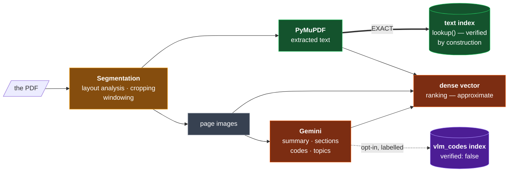
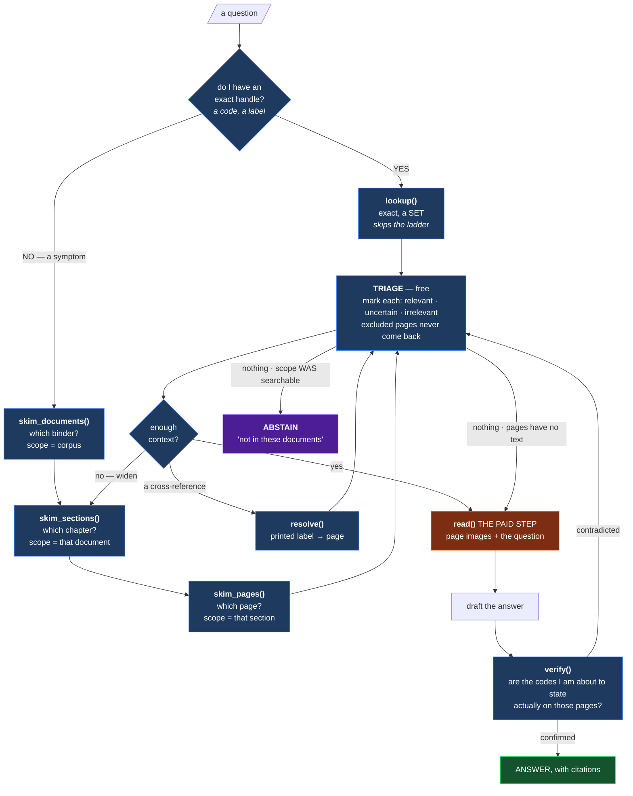
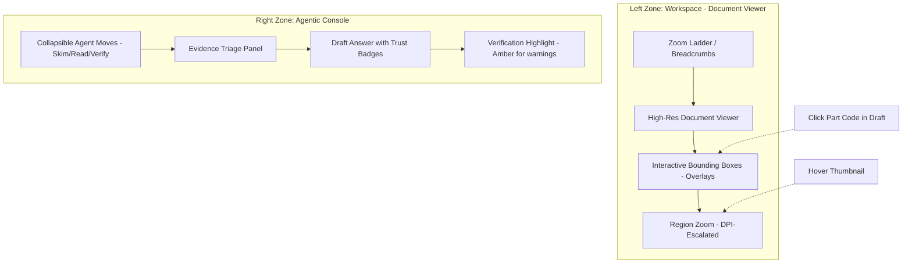

# Vision Segmentation: Unified Implementation Plan

> **Goal:** Ingest any PDF, from any domain, with no regexes, no per-corpus grammar and no
> configuration — and expose it through an agentic retrieval surface modelled on how a
> technician actually finds and checks an answer.
>
> **The core guarantee:** No failure may present itself as a correct answer. In a corpus
> where 8,414 code pairs differ by one character, the only unrecoverable failure is a
> confident wrong answer. Everything below exists to make every other failure *visible,
> typed and attributable* instead.

---

## Part 1 — Architecture

### 1.1 Pipeline Architecture



### 1.2 The One Rule

> **Lexical surfaces index extracted text. The dense surface may include model output.**

Today `entity_keys` is populated from what the *model* claims, so it needs an allowlist gate
to check every entry against the page. A text index is built from what PyMuPDF *extracted*,
so a hallucinated code **cannot be in it** — there is nothing to verify.

That one substitution is what lets ~200 lines and the pipeline's most complex concept
disappear, and it is void the moment model-emitted text enters a lexical index.

### 1.3 Core Principles

- **No Curated Lists:** Exact search is a full-text index over extracted text.
- **Verification by Construction:** The index is built from PyMuPDF text, making hallucinated identifiers impossible to retrieve.
- **Image-First Reasoning:** Reasoning happens over page rasters; text is for triage and citation.

---

## Part 2 — The Generic Pipeline

### 2.1 What the Pipeline Becomes

| Step | Stage | What Changes |
|---|---|---|
| 01 | entry | facets now come from filename / metadata / the uploader |
| 02 | S0 probe + text + render | **unchanged** |
| 03 | S1 document facts | prompt generalised; still picks the ladder |
| 04 | windowing + `extract_key` | **unchanged** |
| 05 | S2 extraction | **new schema** — summary, sections, codes, topics; no identifier grammar |
| 06 | derivation | the offset and the join survive; **the gate is deleted** |
| 07 | stitching | unchanged algorithm, now grouping **sections** instead of units |
| 08 | embedding | payload gains the summary |
| 09 | indexing | **two full-text indexes** replace `entity_keys` |
| 10 | gates | coverage from the probe; `key_coverage` replaces `class_totality` |
| 11 | export | ranges + summaries, or deleted — see §2.8 |

Steps 02, 04 and the whole caching architecture are untouched.

### 2.2 The S2 Response Schema

```python
class SectionRef(BaseModel):
    title:    str  = Field(description="the section/procedure/topic this page belongs to, "
                                       "as printed or as you would name it")
    is_start: bool = Field(default=False, description="true only if it BEGINS on this page")

class PageOut(BaseModel):
    page_index:      int  = Field(description="1-based WITHIN THIS EXCERPT, not the book")
    printed_page_no: str  = Field(default="", description="the page label as printed, VERBATIM")
    page_kind:       str  = "prose"     # prose|table|schematic|exploded|cover|toc|index|blank
    lang:            list[str] = []
    sections:        list[SectionRef] = []
    summary:         str  = Field(description="2-3 sentences on what is SPECIFIC to this "
                                              "page. Do not describe the document generally.")
    codes:           list[str] = Field(default=[], description="every code, tag, part or "
                                                               "reference number, VERBATIM")
    topics:          list[str] = Field(default=[], description="short lowercase labels for "
                                                               "what this page is about")

class WindowOut(BaseModel):
    pages: list[PageOut]
```

**What changed:**

| | |
|---|---|
| `units[]` → `sections[]` | a section is a title and a start flag. No `kind` enum, no grammar, no `attrs`. Still **presence per page, never extent** — so stitching still works across window folds. |
| `identifiers[]` → `codes[]` | same verbatim strings, but they now feed the dense vector and the opt-in index — never the exact one |
| **`summary`** new | the biggest retrieval win (see §2.3) |
| **`topics`** new | replaces the hardcoded keyword list |
| no `refs[]` | measured: **0 reads** anywhere in the codebase |

**Prompt rule for summaries:** *"2–3 sentences on what is SPECIFIC to this page."* — asking for description yields generic text that makes dense vectors less discriminative.

### 2.3 Why the Summary Is the Biggest Win

On a schematic the text layer has no sentences at all:

```
text     "B221 --> K158 - SI3  (B&R X20SI4100 - Safe Dig. In.- 2 channel wiring)
          YV1  FESTO VOFA-L26-T32C-M-G14-1C1-APP (574011)  Q59 …"

summary  "Emergency-stop circuit for the carton discharge unit: pressing the panel
          E-stop de-energises the discharge valve via safety relay K158."
```

*"How does the emergency stop cut the air supply?"* matches the second and never the first.
For schematic-heavy pages, the summary is the **only** natural-language description that
page will ever have.

### 2.4 The Record

```
FLAT · FACETS ─────────────────────────────── indexed keyword / integer
  doc_id · revision · doc_type · subjects · tags · page_kind · lang · page_no

FLAT · FULL TEXT ──────────────────────────── indexed text
  text            the extracted text          EXACT lookup, verified by construction
  vlm_codes       " ".join(codes)             opt-in, always labelled verified:false

VECTORS ─────────────────────────────────────
  dense           image + title + summary + text + codes     ranking
  lexical         (optional)                                 keyword ranking

NESTED under content ──────────────────────── returned, never filtered
  printed_page_no · summary · topics · sections[] · image_path

PROVENANCE ──────────────────────────────────
  page_id · extract_key · embed_key · run_id · schema_version
```

### 2.5 The Index Configuration

```python
for field in ("text", "vlm_codes"):
    client.create_payload_index(
        collection, field_name=field,
        field_schema=qm.TextIndexParams(
            type="text",
            tokenizer=qm.TokenizerType.WORD,
            lowercase=True,
            phrase_matching=True,      # ← consecutive-token matching
            min_token_len=1,           # keep short fragments: SI3, 84, 0020
        ))
```

Verified present in `qdrant-client==1.19.0` and `qdrant/qdrant:v1.19.0`.

**`phrase_matching` is the piece that makes this viable:**

```
"SF 1.1A"       → phrase [sf, 1, 1a]        precise — not "any page with sf and 1"
"84-5140.0020"  → phrase [84, 5140, 0020]   precise — punctuation is irrelevant
"K158"          → single token               exact
```

### 2.6 `lookup()` Becomes a Filter

```python
def lookup(label, filters=None, include_unverified=False, cap=20):
    f = qm.Filter(must=[qm.FieldCondition(key="text", match=qm.MatchText(text=label)),
                        *facet_conditions(filters)])
    total = client.count(collection, count_filter=f, exact=True).count
    hits, _ = client.scroll(collection, scroll_filter=f, limit=cap)
    ...
    # include_unverified → repeat against "vlm_codes", tag verified=False, never merge scores
```

| | `entity_keys` today | full-text index |
|---|---|---|
| exact match | yes | yes — real inverted index |
| multi-token ids | yes | yes — `phrase_matching` |
| set + `capped` | yes | yes — `count(exact=True)` then `scroll` |
| composes with facets | yes | yes — same `must` clause |
| verified | via a gate | **structurally** |
| needs a grammar | nine regexes | **none** |

### 2.7 The Health Signal That Replaces the Gate

```python
seen   = {c.lower() for c in page.codes}          # what the model saw
have   = token_set(page.text)                     # what the text layer has
grounded = len(seen & have) / len(seen) if seen else 1.0
```

```
40 seen · 38 grounded    healthy
40 seen ·  0 grounded    the text extraction is BROKEN on this page
40 seen ·  2 grounded    the TC1E-PERIODIC signal — found automatically
```

### 2.8 Three Decisions Before Building

**9.1 · Is the graph team still a consumer?** If yes, `labels.jsonl` changes shape. If no, the export step disappears (~60 lines).

**9.2 · Does the sparse vector still earn its place?** Measure: run `search` with `weights={"lexical": 0}` and compare. Dropping it removes `sparse.py`, RRF fusion and one branch.

**9.3 · Should `vlm_codes` ship in v1?** Opt-in and safe, but a second index and trust level. Shipping without is simpler; adding later is additive.

### 2.9 What Gets Deleted

```
DELETED                                          179 lines
  SCHEMA_CARD + IdClass, classify(), normalise()
  STRICT_KINDS + key_for_unit, Identifier dataclass
  backed_keys() + entity_keys_for(), Scope.entity_keys
  gate() + backs(), identifiers_from_text()
  _is_safety() + keyword list, identifier merge
  withheld.jsonl export, allowlist + class_totality gates

ADDED                                             65 lines
  summary / topics / codes / sections in schema
  two text-index creations
  lookup() rewritten as a filter
  the grounded-rate health metric

NET                                             −114 lines
```

Plus `sparse.py` (42 lines) if the lexical vector does not survive §2.8.

### 2.10 Pipeline Risk Mitigations

**Scanned/Non-searchable Pages:** When exact `lookup` fails but `searchable_ratio` is low, the agent falls back to `vlm_codes` and fetches/reads raw images. Retain `vlm_codes` as a secondary, clearly marked, unverified index.

**Ingestion VLM API Cost & Rate Limits:** Hash page images (SHA-256) to cache VLM outputs. Re-running on identical pages costs $0. Implement token-bucket rate limiter and exponential backoff on the Gemini API client.

---

## Part 3 — Agentic Retrieval

### 3.1 What a Person Actually Does

Trace a real one: *"The carton discharge won't restart after an E-stop reset."*

```
1 · ORIENT       which machine is this? which binders do I even have?
2 · HANDLE       turns a symptom into something addressable
3 · ENTER        KNOWS the handle → index → straight to the page
                 VAGUE → contents page, skim headings, flip
4 · LOOK         on a schematic they look at the PICTURE first
5 · WIDEN        found it on page 30 → reads 29 and 31
6 · FOLLOW       "see sheet 152" → turns to sheet 152
7 · CROSS-CHECK  checks the number against the parts list
8 · STOP         "this isn't in this manual — I need the E-diagram set"
9 · REMEMBER     doesn't re-open pages already checked
```

**Nine moves. Most RAG agents are handed one tool — `search` — and told to do all nine with it.**

### 3.2 Three Ways an Agent Differs

| | a person | an agent |
|---|---|---|
| **skimming** | free — peripheral vision | every look costs money and latency |
| **context** | effortless | must be handed back what it already knows |
| **doubt** | *feels* uncertain | must be **told** the evidence is weak |

So: make triage cheap, make state explicit, and **put the uncertainty in the payload**.

### 3.3 The Image Is the Reasoning Context

An answer comes from a **vision model looking at a page raster**. Text has three supporting roles:

```
IMAGE   ->  REASONING       the only thing that can read a schematic
TEXT    ->  CHOOSING        summaries, so triage is cheap and free
        ->  PROVING         verify(), so a claim can be checked
        ->  CITING          quoting the document, not a paraphrase
```

Every tool that returns a page **hides the image**. `read()` sends rasters to Gemini internally and hands back an extract; the caller never sees the page. Three routine human moves become impossible:

| move | why it breaks |
|---|---|
| **compare two pages** | `read` returns two independent per-page extracts |
| **ask a follow-up** | re-bills a full vision call |
| **zoom in** | no tool for *"show me that corner bigger"* |

The fix is `fetch` — returns **material instead of an answer**.

### 3.4 The Zoom Ladder

A person never searches 142 pages. They **narrow, then repeat the same move in a smaller space**:

```
corpus      "which binder?"       skim  →  3 documents, one strong
document    "which chapter?"      skim  →  section, pages 1-30
section     "which page?"         skim  →  p001, p002
page        "what does it say?"   READ  →  the paid call
```

All three levels come from the **one page index** — no extra storage:

```python
skim_documents(query, scope)   # page hits grouped by doc_id
skim_sections(query, scope)    # grouped by section_id
skim_pages(query, scope)       # the pages themselves
```

Scope tightens each round:

```
scope_0  {}                                              142 pages · the corpus
scope_1  {doc_id: "TC1E-SF"}                              55 pages · one binder
scope_2  {doc_id: "TC1E-SF", section_id: "…#s004"}        30 pages · one chapter
```

### 3.5 The Agentic Retrieval Loop



Three structural points from the human model:

1. **Narrowing is the same move repeated.** Three skims, each in a smaller scope.
2. **The expensive step happens once, late, after free narrowing.** Every skim, triage, resolve and verify is free.
3. **Verification happens AFTER drafting, not before.** The agent drafts, then checks the codes.

### 3.6 Eight Interface Principles

**P1 · One tool per decision, not per data structure.** `lookup` vs `search` is a decision about what kind of handle you have.

**P2 · Cheap to triage, expensive to consume.** `search` returns enough to choose, never enough to answer. No full text in triage results.

**P3 · Every result carries its own trust level.**

```
verified: true|false        did the page's own text back this?
grounded_rate: 0.0-1.0      how much of what the model saw is in the text layer
flags: ["no_text", "interpolated_head", "noncontiguous_unit"]
interpolated: true          this page number was inferred, not observed
```

**P4 · Results carry the next moves.** Cross-references, neighbours, and section context in every result:

```json
"next": {
  "expand":     "TC1E-SF@1.3#s004",
  "neighbours": ["…#p029", "…#p031"],
  "references": ["sheet 152", "7-12"]
}
```

**P5 · Absence is a typed answer, not an empty list.** Four distinct states:

| state | agent action |
|---|---|
| `not_found` — genuinely absent | **abstain** |
| `not_searchable` — no text layer | **escalate to vision** |
| `out_of_scope` — filters matched nothing | **re-orient** |
| `error` — backend is down | **retry / report** |

**P6 · Never silently degrade.** Unknown filter key → `400`. Capped result → `"capped": true`. A guess → `"interpolated": true`.

**P7 · Verification is a move the agent makes.**

```python
verify(claims=["K158", "EAO 84-5140.0020"], page_ids=["TC1E-SF@1.3#p001"])
→ {"K158": {"present": true, "page_ids": ["…#p001"]},
   "EAO 84-5140.0020": {"present": true, "page_ids": ["…#p001"]}}
```

**P8 · Return material as well as answers.** `read` delegates reasoning; `fetch` returns the page itself.

| | what you get | what it costs |
|---|---|---|
| `fetch` | the raw page — **you** reason over the image | your own context, ~1-2k tokens/image |
| `read` | a bounded extract — a sub-model reasons | a Gemini call |

### 3.7 The Tool Surface

**Six tools** (eight rows), grouped by the decision each serves:

| | tool | signature | cost |
|---|---|---|---|
| **NARROW** | `skim_documents` | `(query, scope?, exclude?) → [{doc_id, title, doc_type, pages_matched, best_rank, searchable_ratio}]` | free |
| | `skim_sections` | `(query, scope, exclude?) → [{section_id, title, page_range, pages_matched}]` | free |
| | `skim_pages` | `(query, scope, exclude?) → [{page_id, printed_page_no, summary, page_kind, why, flags, next}]` | free |
| **JUMP** | `lookup` | `(label, scope?, include_unverified=False) → a SET + total + capped` | free |
| **FOLLOW** | `resolve` | `(printed_label, doc_id?) → page_id + interpolated` | free |
| **LOOK** | `fetch` | `(page_ids, include=["image","text","summary"], dpi=220, region=None) → the raw pages` | free-ish |
| **COMPREHEND** | `read` | `(page_ids, question) → extracts + per-page provenance` | **the budget** |
| **CHECK** | `verify` | `(claims, page_ids) → per-claim present/absent + where` | free |

**`fetch` — the missing "LOOK" move:**

```python
fetch(["…#p001"], dpi=150)                             # the whole page, cheap
fetch(["…#p001"], dpi=400, region=[0.5, 0.0, 1.0, 0.4])  # that corner, properly
```

`region` is normalised `[x0, y0, x1, y1]`. PyMuPDF renders a clip at any dpi on demand — no new storage.

### 3.8 Triage — Loop 0

The cheapest correction happens **before** any money is spent:

```
skim_pages  →  10 candidates
   relevant (2)   uncertain (3)   irrelevant (5)
     read          fallback pool    excluded from later skims
```

**Tri-state, not binary.** The `uncertain` pool is the fallback when confident picks fail.

State lives in the agent, not the service:

```python
skim_pages(query, scope, exclude=["…#p014", "…#p022"])
```

**Safeguards against summary hiding the answer:**

| safeguard | |
|---|---|
| rejections stay soft | on `sufficient: false`, try `uncertain` before widening |
| do not filter a small set | with 3 candidates, read them all |
| use `why` as the signal | `lexical` hit for an exact code is stronger than dense-only |
| auto-promote exact hits | if query has an exact identifier and hit `why` is `lexical`, bypass triage |
| strict agent-prompt constraints | enforce tri-state triage in system prompt |

### 3.9 VLM Cost & Latency Mitigations

| | |
|---|---|
| **strict page caps on `read`** | max 3 page images per query; sequential fetch or user consent for more |
| **DPI-budgeted `fetch`** | default `dpi=150`; escalate to 300/400 only for targeted `region` crops |
| **image caching** | cache rendered page images on-demand across multi-turn conversations |

### 3.10 The Six Correction Loops

```
TRANSCRIPTION   "I read K153; the text layer says K158"
                mechanical · deterministic · same page · NO judgment
                → INSIDE read, automatic, always

RETRIEVAL       "this page does not answer the question"
                a judgment about the search itself
                → OUTSIDE read, in the agent's loop
```

| | trigger | correction | where |
|---|---|---|---|
| **0** | candidate looks wrong in triage | mark `irrelevant`, exclude | the loop — **before any spend** |
| **1** | a code was misread | stamp `verified: false` | **inside `read`** — automatic |
| **2** | about to assert a claim | `verify(claims, page_ids)` | after `read` — deliberate |
| **3** | `sufficient: false` | widen scope, re-skim | the loop |
| **4** | `verify` contradicts draft | try a different page | the loop |
| **5** | nothing found AND `searchable_ratio < 1` | `fetch` / `read` image-only pages | the loop |

### 3.11 A Worked Trace

*"The carton discharge won't restart after an E-stop reset."*

```
1  skim_documents("carton discharge restart after emergency stop",     free
                  scope={subjects:["C24"]})
   → TC1E-SF        12 pages matched · searchable 1.00   ← the binder
     LTC1AV81        2 pages matched · searchable 1.00
     CE-TC1AV8       0 pages matched · searchable 0.00   ← blind spot, noted

2  skim_sections(same query, scope={doc_id:"TC1E-SF"})                 free
   → section "Emergency stop circuits"   pages 1-30 · 6 matched

3  skim_pages(same query, scope={doc_id:"TC1E-SF",                     free
                                 section_id:"…#s004"})
   → p001  "Emergency-stop circuit for the carton discharge unit…"
     p002  "Reset interlock conditions for the discharge start…"

4  read(["…#p001","…#p002"], question)                                 THE ONLY PAID CALL
   → "SF 1.2a: reset requires Q25 released AND K158 energised"

5  verify(["Q25","K158","SF 1.2a"], ["…#p001"])                        free
   → all three present

6  ANSWER, citing p001-p002
```

**One paid call in six steps.** The exact path (with a known handle) skips the ladder entirely:

```
1  lookup("SF 1.2a")            free   → p001, p002
2  read([...], question)        paid
3  verify([...])                free
```

**The failure branch:**

```
1' skim_documents(...)  →  0 pages matched anywhere
   but CE-TC1AV8 reported searchable_ratio 0.00
   → agent does NOT abstain — reads image-only pages
   → still nothing: ABSTAIN, naming which documents were searched
     and which could not be searched by text
```

### 3.12 What Stays Refused

| refused | why |
|---|---|
| returning a **score** | a technician says "it's on this page" or "let me check" |
| **routing** the query | choosing the binder is the expert's judgment |
| composing the **answer** | the manual shows you the page; safety precedence is the reader's call |
| **fuzzy matching on codes** | a miss must be "no such code" + neighbours labelled as different — never a silent nearest match |

---

## Part 4 — MCP Server Architecture

### 4.1 Overview

- **Server Name:** `vision-segmentation-retriever`
- **Purpose:** Expose retrieval, reasoning, and verification tools to any MCP-compliant LLM client.
- **State Management:** Session-scoped `scope` (current context).

### 4.2 MCP Tool Definitions

| MCP Tool | Description | Parameters |
|:---|:---|:---|
| `skim_documents` | List binders/docs in scope | `query`, `scope`, `exclude` |
| `skim_sections` | List sections in a document | `query`, `scope`, `exclude` |
| `skim_pages` | List pages in a section | `query`, `scope`, `exclude` |
| `lookup` | Exact handle lookup | `label`, `scope`, `include_unverified` |
| `resolve` | Resolve printed labels to page_id | `printed_label`, `doc_id` |
| `fetch` | Get raw page image/text | `page_ids`, `dpi`, `region` |
| `read` | Delegate reasoning (Paid Step) | `page_ids`, `question` |
| `verify` | Structural claim verification | `claims`, `page_ids` |

### 4.3 Server Structure

```text
mcp-server/
├── src/
│   ├── tools/          # Implementation of MCP tools
│   ├── indexer/        # Qdrant client & vector operations
│   ├── vlm/            # Gemini client & caching logic
│   └── state.py        # Session-based scope management
├── schema/             # JSON Schema for tool parameters
└── server.py           # MCP entry point (Stdio/SSE)
```

### 4.4 Session State Management

```python
class RetrievalState:
    def __init__(self):
        self.scope = {}           # current doc_id, section_id, etc.
        self.exclude_list = []
```

### 4.5 Tool Invocation Patterns

- **Provenance:** Every result includes `page_id`, `run_id`, `schema_version`.
- **Health:** Every result includes `grounded_rate` or `no_text` flags.

### 4.6 Paid Step Protection

1. Check `page_ids` count against the 3-page limit.
2. Check `vlm_cache` (hash-based) for prior reasoning.
3. Log to audit trail for enterprise visibility.

### 4.7 Security & Observability

- **Auth:** MCP standard headers for identity propagation.
- **Logging:** All `read()` calls logged with `(user_id, page_ids, timestamp, token_usage)`.
- **Error Handling:** Exponential backoff for rate limits; structured `not_found` / `not_searchable` states.

---

## Part 5 — Fail-Proof Implementation

### 5.1 Seven Invariants

Each rule has a mechanical enforcement and a test that fails if someone removes it.

**I1 · One page, one point**

```python
point_id = uuid5(NAMESPACE, page_id)             # idempotent: re-ingest overwrites
assert len({r.page_id for r in records}) == len(records)
assert count(doc_id=d, revision=r) == pdf.page_count      # after publish
```

**I2 · The exact surface contains only extracted text**

```python
def test_hallucinated_code_is_unfindable():
    index(page(text="B221 K158 SI3", codes=["K999"]))       # model claims K999
    assert lookup("K999").status == "not_found"              # exact surface: nothing
    assert lookup("K999", include_unverified=True).unverified_hits   # labelled, separate
```

**I3 · Exact matching is phrase-only, varies only by whitespace**

```python
def test_variants_differ_only_in_whitespace():
    for label in ["SF 1.1A", "K73", "EAO 84-5140.0020", "S202-S203", "SF121.1A"]:
        base = re.sub(r"\s+", "", label).lower()
        for v in variants(label):
            assert re.sub(r"\s+", "", v).lower() == base      # K73 can never yield K78
```

**I4 · The page offset is proved, never assumed**

```python
abs_page = window.start + page_index - 1
# structural: window returned exactly the pages it was given
# independent: printed label the model read must be in THIS page's text
```

**I5 · Absence is typed; an empty list is never a bare `200`**

```python
class ToolResponse(BaseModel):
    status: Literal["ok", "not_found", "not_searchable", "out_of_scope", "error"]
    hits: list[Hit] = []
    scope_stats: ScopeStats

    @model_validator(mode="after")
    def empty_is_never_ok(self):
        assert self.hits or self.status != "ok"
        return self
```

**I6 · Nothing is filtered on an unindexed field**

```python
INDEXED = {"doc_id": "keyword", ..., "has_text": "bool", "page_no": "integer"}
# one dict creates indexes, gates filters, and is asserted at boot
```

**I7 · Every asserted code is verified against the page it is cited on**

```python
for code in codes_in_draft:
    v = verify([code], [cited_page_id])[code]
    if v.status == "present":    render(code)
    elif v.status == "unverifiable":  render(code, badge="read from image, not text-verified")
    else:                        reject_draft(code, v.present_instead)
```

### 5.2 The Failure-Mode Catalogue

Every path to a confidently wrong answer, with the guard and test. **This table is the definition of done.**

| # | Failure | Guard | Test |
|---|---|---|---|
| F1 | `lookup` returns wrong page as exact | I3 phrase-only | `SF 1.1A → exactly 1` |
| F2 | `verify` confirms absent code | one `exact_filter` | `verify('SF 1.1A', p008) → absent` |
| F3 | Abstains on a printed label | I3 variants | the 8 compact labels |
| F4 | *"That part doesn't exist"* about a scanned page | `has_text` facet + I5 | scanned doc → `not_searchable` |
| F5 | Cross-reference to wrong page | `get_label()` precedence, `label_verified` | misread label → flagged |
| F6 | Cites page for neighbour's code | per-page `grounded_rate`, I7 | code moved → `moved_from` recorded |
| F7 | Every page number shifted by one | I4 | synthetic 3-window fixture |
| F8 | Searches subset believing it searched the chapter | canonical key + `series_id` | straddling-section fixture |
| F9 | Cites superseded revision as current | `is_current` default | two revisions indexed |
| F10 | Silent recall loss | I6 | unknown key → 400 |
| F11 | Cache serves wrong model output | window-composed key incl. resolved version | key changes when prompt changes |
| F12 | Totals double; stale pages stay findable | I1 + delete by `run_id` | re-ingest twice → same count |
| F13 | Window truncates and loses 30 pages | output-budget ladder; `MAX_TOKENS` → bisect | oversized window bisects |
| F14 | Model-invented code becomes findable | I2 | hallucination test |
| F15 | Code invisible because it was cropped | `text` from **full** page | crop fixture → full text indexed |
| F16 | Near-miss code presented as answer | `present_instead` = prefix filter, capped | `K73` on K78 page → `absent` + `present_instead` |
| F17 | Unbounded spend; raster exfiltration | caps, bearer token, cost on response | over-cap → 400; no token → 401 |

**Every row degrades to a visible state** — an abstention, a flag, a 4xx — never to a plausible wrong page.

### 5.3 The Test Pyramid

**Freeze one real extraction as a fixture** — everything downstream is testable forever at zero cost.

```
data/fixtures/TC1E-SF/
  raw_window_1.json      the VERBATIM WindowOut for pages 1-30
  raw_window_2.json      pages 31-55
  text.json              PyMuPDF text per page
  expected.json          the acceptance table
```

| Level | What it tests | Needs | Runtime |
|---|---|---|---|
| **L0** | pure functions: `tok`, `variants`, offset, label normalisation, stitching | nothing | < 1 s |
| **L1** | derivation over frozen `raw_window_*.json` → 55 page records | fixture | < 5 s |
| **L2** | index contract: acceptance table against ephemeral Qdrant | docker | < 30 s |
| **L3** | **adversarial abstention** — the safety test | docker | < 60 s |
| **L4** | worked trace and failure branch, end to end | docker + Gemini | minutes |
| **L5** | canary on held-out document | full stack | manual |

**L2 · The Acceptance Table:**

```
lookup("SF 1.1A")                       → exactly 1 page
lookup("SF 5.5b")                       → exactly 1 page
lookup("SF 121.1")                      → 1 page
lookup("EAO 84-5140.0020")              → 10 pages
lookup("B&R X20SI4100")                 → 54 pages
lookup("3")            unscoped         → weak:true, needs_scope
lookup("alarm 152")                     → 0 by phrase → the ladder
verify("SF 1.1A", [p008])               → absent
scanned document                        → not_searchable, never not_found
```

**L3 · Adversarial Abstention Eval:**

```python
def test_near_miss_codes_never_answer():
    for fake in near_misses(n=100):
        r = lookup(fake)
        assert r.hits == []
        assert r.status in ("not_found", "not_searchable")
        for n in r.present_instead.values():
            assert n != fake
```

### 5.4 Two Kinds of Gate

**Publish gates** — decide whether a document becomes visible:

| gate | metric | threshold | action |
|---|---|---|---|
| `window_coverage` | pages with S2 record / page count | must be 1.0 | **block** |
| `offset_check` | windows passing I4 | all | **block** |
| `grounded_rate` | document median | >= 0.8 | **block**, hold for review |
| `text_coverage` | pages with `has_text` / total | — | flag `mostly_scanned` |
| `label_monotonic` | printed labels non-decreasing | — | flag `label_conflict` |

**Answer gates** — decide whether a draft may be shown:

- No code asserted that `verify` did not return `present` for (I7)
- *"Not in these documents"* forbidden while unsearchable pages remain unexamined
- Pages with `text_trust != ok` require zoom-and-re-read; codes carry *"read from image"* badge

### 5.5 Runtime Degradation Policy

| condition | behaviour |
|---|---|
| Qdrant unreachable | `503`, retryable — **never** empty result |
| Gemini unreachable | `503` on `read`; free tools keep working |
| index schema != pinned config | **refuse to serve** at boot (I6) |
| embedding model != collection fingerprint | **refuse to upsert**; new collection + full re-embed + alias swap |
| configured model id ends in `-latest` | **refuse to start** (F11) |
| document's `grounded_rate` collapses | mark `text_untrusted`; pages count as unsearchable |
| per-caller `read` quota exhausted | typed `budget_exhausted`, not silent truncation |

**Observability:** Prometheus gauges for `ingest_grounded_rate_median{doc_id}` and `ingest_gate_failures_total{gate}`; per-response cost `{model, input_tokens, output_tokens, image_count, latency_ms}`; audit line for every `read` and `fetch`; triage marks as free evaluation data.

### 5.6 Residual Risks (Stated Honestly)

- **Recall is not guaranteed.** A summary can omit the key line. Mitigated by `uncertain` pool, "don't filter a small set", and `codes_in_text` as hard signal — but a miss surfaces as honest abstention, never a wrong page.
- **Scanned page codes are never text-verified.** They come back `unverifiable` forever. Zoom-and-re-read reduces transcription error; it does not eliminate it.
- **The extractor is the single point of truth.** If PyMuPDF misses text, `lookup` is blind. Detection: `grounded_rate` collapse.
- **`grounded_rate >= 0.8` is a chosen threshold.** Measure on pilot corpus in M2 and set from data.

---

## Part 6 — Enterprise UI Concept



---

## Part 7 — Build Order

### 7.1 Milestone Plan (Prove the Design Before Spending Money)

Every correctness property that can be proved without a model call is proved first.

| | Milestone | Delivers | Acceptance | Spend |
|---|---|---|---|---|
| **M0** | Spec fixes | S01–S07, N1–N2 written into plan docs; decisions closed | a builder can implement without guessing | none |
| **M1** | `core/` + L0/L2 | record, `exact_filter`, `tok`, `variants`; ephemeral Qdrant; **hand-written page text, no PDF** | F1 F2 F3 F10 F14 F16 closed; acceptance table passes on synthetic text | **none** |
| **M2** | `ingest/` one PDF | manifest, probe, windows, extract, derive, embed, index, gates | 55 points; I1 I4 hold; **fixture frozen** | S2 + embed, once |
| **M3** | `lookup` + `verify` | typed absence, `present_instead`, `unverifiable` | full acceptance table + **L3 abstention eval** on real text | none |
| **M4** | `skim_pages`, `fetch`, `resolve` | triage rows, `exclude`, `next`, caps, auth, cost | narrowing returns p001/p002; 401 without token | none |
| **M5** | skims + runner | document/section rungs, browse mode, the loop | worked trace completes in **one paid call**; failure branch abstains with coverage | read only |
| **M6** | `read`, revisions, jobs | per-page schema, `is_current`, resumable ingest | F9 F12 F13 closed; 1,440-page ingest survives a kill at window 700 | read |

**M1 is the whole proof and it costs nothing.** Three synthetic pages whose text you control settle the phrase-vs-any-order question, the compact-label question and the hallucination question before a single PDF is opened.

### 7.2 Granular Build Steps

| | Step | Cache |
|---|---|---|
| **1** | tests for offset, join and stitching — **before** touching them | free |
| **2** | add both text indexes; rewrite `lookup()` against `text`; keep everything else | **free** |
| **3** | verify `lookup` parity on real corpus against today's `entity_keys` results | free |
| **4** | new S2 schema — summary, sections, codes, topics; drop identifiers and refs | one re-bill |
| **5** | delete the gate, `SCHEMA_CARD`, `classify`, `entity_keys` and friends | free |
| **6** | generalise S1/S2 prompts; add `subjects` / `tags` facets | same re-bill as step 4 |
| **7** | add grounded-rate metric; replace `class_totality` with `key_coverage` | free |

**Step 2 is the whole proof, and it costs nothing.** Add the text index alongside existing `entity_keys` and check that `lookup("SF 1.1A")`, `lookup("K158")` and `lookup("EAO 84-5140.0020")` return the right pages.

---

## One Line

> **Give the agent the moves a person actually makes — orient, narrow, look, widen, follow,
> check, stop — and make every result say how much to trust it. The image is what it reasons
> over; the text is how it chooses, proves and cites. Make every rule an assertion, every
> path to a wrong answer a row in a table with a test beside it, and prove the exact-match
> surface on synthetic text before spending a cent.**
